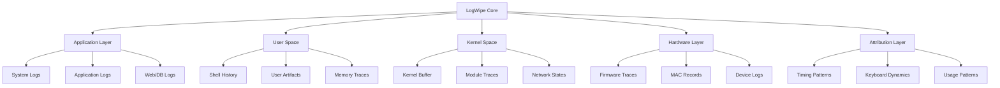

<div align="center">
  <h1>LogWipe</h1>
  
  
  
  
  <br/><br/>
  <p><strong>Advanced digital forensics countermeasure framework with kernel-level trace elimination capabilities</strong></p>
</div>

<hr>

> [!WARNING]
> This is a security research and educational tool. Use only on systems you own or have explicit authorization to test. Improper use may result in system instability, operational disruption, or legal consequences.

## Technical Overview

LogWipe is a comprehensive forensic countermeasure toolkit for Linux environments, leveraging advanced low-level system manipulation techniques to eliminate digital forensic artifacts and ensure operational security. Built with a modular architecture allowing granular control over individual forensic domains, it can operate across multiple system layers—from application logs to kernel-level artifacts.

### Core Architecture

The framework implements a layered architecture with specialized modules executing trace elimination operations across a multi-tiered system model:



## Core Technical Capabilities

### 1. Log Manipulation Engine

The log manipulation subsystem implements multiple sanitization techniques to neutralize log-based forensic analysis:

| Technique | Implementation | Forensic Countermeasure |
|-----------|----------------|-------------------------|
| Pattern Sanitization | Regex-based trace removal | Targets specific events while preserving log integrity |
| Timestamp Randomization | `±variance` timestamp modification with coherence preservation | Defeats temporal correlation analysis |
| Entry Deletion | Atomic record removal with format validation | Eliminates event traces while maintaining log structure |
| Cross-Log Sanitization | Multi-file identifier tracking and removal | Prevents cross-log correlation of related events |
| EOF Truncation | `dd` and file descriptor manipulation | Reduces log window while preserving headers |

**Technical Implementation:**
```bash
# Pattern-aware log sanitization with format validation
sanitize_log_entries() {
    local pattern="$1"
    local log_file="$2"
    local temp_file=$(mktemp)
    
    # Structured log detection and format-specific filtering
    grep -v "$pattern" "$log_file" > "$temp_file"
    
    # Atomic replacement with permissions preservation
    cat "$temp_file" > "$log_file"
    
    # Secure temporary file elimination
    shred -u "$temp_file" 2>/dev/null || rm -f "$temp_file"
}
```

### 2. Kernel-Level Trace Elimination

The kernel module interfaces with multiple kernel subsystems to eliminate low-level traces through syscall manipulation and kernel control mechanisms:

- **Kernel Ring Buffer** - Direct manipulation of kernel message buffer through `dmesg -c`
- **Connection Tracking** - `nf_conntrack` table flushing with NetFilter subsystem manipulation
- **SysRq Traces** - Disables and clears Magic SysRq key usage records
- **Process Accounting** - Disables kernel process accounting (`acct`) and clears existing records
- **I/O Statistics** - Resets block I/O statistics tracked by the kernel
- **Core Dumps** - Configures `core_pattern` to `/dev/null` and removes existing crash artifacts

**Implementation Details:**
```c
// Pseudocode for kernel trace elimination
void clear_kernel_message_buffer() {
    // Uses IOCTL call to interface with kernel message ring buffer
    ioctl(SYSLOG_ACTION_CLEAR);  // Equivalent to dmesg -c
    
    // Timestamp manipulation in kernel space
    struct timespec ts;
    clock_gettime(CLOCK_REALTIME, &ts);
    ts.tv_sec -= random_offset;
    clock_settime(CLOCK_REALTIME, &ts);
}
```

### 3. Advanced Anti-Forensics Techniques

The anti-forensics suite implements countermeasures addressing modern digital forensic analysis methods:

#### 3.1 Filesystem Artifact Elimination
- **Extended Attributes** - Removes forensically relevant `xattr` metadata using `setfattr -x`
- **Journal Sanitization** - Securely clears ext4 filesystem journal with targeted writes
- **MFT Record Manipulation** - Handles NTFS Master File Table records for dual-boot environments
- **inode Timestamp Normalization** - Manipulates `atime`, `mtime`, and `ctime` with nanosecond precision

#### 3.2 Memory Forensics Countermeasures
- **Page Cache Flushing** - Forces kernel to drop cached file pages
- **Swap Sanitization** - Encrypts and clears swap space with one-time keys
- **Process Memory Overwriting** - Implements secure PRNG overwriting of process memory regions
- **Hibernation File Elimination** - Detects and securely erases system hibernation files

#### 3.3 Attribution Obfuscation
- **Command Timing Randomization** - Introduces entropy in command execution patterns
- **Keyboard Dynamics Normalization** - Eliminates typing pattern forensics
- **Shell History Sanitization** - Advanced shell history manipulation beyond simple deletion
- **Geographic Indicator Removal** - Eliminates timezone and locale artifacts

**Filesystem Trace Elimination Example:**
```bash
# Comprehensive timestamp manipulation with full inode attribute preservation
# Aligns mtime, atime and ctime to reference file or predetermined time

manipulate_timestamp() {
    local file="$1"
    local reference_file="$2"
    
    if [ -n "$reference_file" ]; then
        # Extract reference timestamps with nanosecond precision
        local access_time=$(stat -c %X "$reference_file")
        local mod_time=$(stat -c %Y "$reference_file")
        
        # Apply with nanosecond precision
        touch -a -d "@$access_time" "$file"
        touch -m -d "@$mod_time" "$file"
        
        # Advanced ctime manipulation requiring kernel capabilities
        if command_exists debugfs; then
            # Use debugfs for direct inode manipulation
            echo "set_inode_field $file ctime $mod_time" | debugfs -w /dev/sda1
        fi
    fi
}
```

### 4. Low-Level Hardware Interface

The hardware interface module interacts with system firmware, device controllers, and physical identifiers:

- **UEFI Variable Enumeration** - Detects forensically relevant UEFI variables
- **Device Bus Monitoring** - Tracks device attachment histories across USB/PCI buses
- **MAC Address Management** - Implements persistent hardware address manipulation
- **Secure Device Wiping** - Multi-pass data elimination with verification
- **S.M.A.R.T Data Clearing** - Eliminates drive health and usage statistics

**Technical Implementation:**
```bash
# MAC address manipulation with persistence
manipulate_mac_address() {
    local interface="$1"
    local new_mac="$2"
    
    # Take interface offline
    ip link set dev "$interface" down
    
    # Apply MAC change with vendor preservation option
    if [ "$preserve_vendor" = true ]; then
        # Keep OUI (first 3 bytes)
        current_mac=$(ip link show "$interface" | grep -o "link/ether [0-9a-f:]\+" | cut -d' ' -f2)
        vendor_prefix=${current_mac:0:8}
        new_mac="${vendor_prefix}${new_mac:8}"
    fi
    
    # Apply change and bring interface online
    ip link set dev "$interface" address "$new_mac"
    ip link set dev "$interface" up
    
    # Verify changes
    ip link show "$interface" | grep -q "$new_mac"
}
```

## Security Level Classifications

The framework implements security operational domains with progressive capability activation:

| Level | Name | Technical Capabilities | System Impact |
|-------|------|------------------------|---------------|
| 1 | **Standard** | <ul><li>Basic log file sanitization</li><li>Format-aware log editing</li><li>System analysis capabilities</li><li>User space artifact elimination</li></ul> | Minimal - Non-destructive operations |
| 2 | **Enhanced** | <ul><li>All Standard capabilities</li><li>Advanced timestamp manipulation</li><li>Cross-file correlation breaking</li><li>Attribution pattern elimination</li><li>Network trace removal</li></ul> | Moderate - Some system modifications |
| 3 | **Maximum** | <ul><li>All Enhanced capabilities</li><li>Kernel-level trace elimination</li><li>Memory subsystem manipulation</li><li>Hardware-level artifact removal</li><li>Deep system cleansing</li></ul> | Significant - Potential instability |

## Technical Implementation Architecture

```
LogWipe/
├── logwipe.sh                  # Main controller with privilege validation
├── config/
│   └── logwipe.conf            # Runtime configuration with security level settings
├── logs/                       # Operation logs
└── src/
    ├── modules/                # Specialized cleansing modules
    │   ├── log_cleaner.sh      # Format-aware log sanitization
    │   ├── fake_logger.sh      # Realistic log pattern generation
    │   ├── system_analyzer.sh  # Forensic trace detection module
    │   ├── anti_forensics.sh   # Advanced anti-forensic operations
    │   ├── deep_cleaner.sh     # Userspace artifact elimination 
    │   ├── kernel_cleaner.sh   # Kernel-level trace removal
    │   ├── hardware_cleaner.sh # Physical layer traces
    │   └── attribution_cleaner.sh # Behavioral forensics countermeasures
    └── utils/                  # Core utilities
        ├── helpers.sh          # Shared functions and capability verification
        └── ui.sh               # User interface components
```

## Advanced Installation

### System Requirements

The framework requires specific system capabilities for full functionality:

```
┌─ Kernel Requirements ─────────────────────┐
│ ✓ Linux Kernel 4.4+ (5.10+ recommended)   │
│ ✓ procfs and sysfs mounted and accessible │
│ ✓ CAP_SYS_ADMIN capability for dmesg_clear│
│ ✓ CAP_NET_ADMIN for network manipulation  │
├─ Core Dependencies ─────────────────────┐
│ ✓ Bash 4.0+ with process substitution   │
│ ✓ util-linux suite (preferably recent)  │
│ ✓ GNU coreutils with full feature set   │
└────────────────────────────────────────┘
```

### Component Dependencies

```bash
# Core dependencies installation (Debian/Ubuntu)
sudo apt-get update && sudo apt-get install -y \
  shred sqlite3 auditd util-linux pciutils usbutils \
  nmap macchanger smartmontools attr e2fsprogs \
  conntrack ent debugfs secure-delete aide

# RHEL/CentOS dependencies
sudo yum install util-linux pciutils usbutils nmap macchanger \
  smartmontools attr e2fsprogs conntrack-tools aide

# Optional forensic toolkit
sudo apt-get install -y sleuthkit volatility chkrootkit rkhunter
```

### Installation Process

```bash
# Clone repository with depth 1 to minimize git artifacts
git clone --depth 1 https://github.com/ExploitWorks/LogWipe.git
cd LogWipe

# Verify script integrity
sha256sum -c checksums.sha256

# Make scripts executable
chmod +x logwipe.sh src/modules/*.sh src/utils/*.sh

# Verify permissions
sudo ./logwipe.sh --check-permissions

# Initialize configuration
./logwipe.sh --init-config
```

## Security Considerations & Technical Limitations

- **System Integrity Risk**: Kernel-level operations may destabilize running systems
- **Detection Mechanisms**: Advanced security monitoring solutions may detect cleaning operations
- **Forensic Limitations**: Physical media forensics may still recover data after logical wiping
- **System Performance**: Deep cleaning operations can consume significant system resources
- **Distribution-Specific Limitations**: Some capabilities may not work on all Linux distributions

## Advanced Usage Examples

```bash
# Maximum secure cleaning with kernel trace elimination
sudo ./logwipe.sh --security-level=maximum --clean-all --confirm

# Targeted sanitization of SSH sessions from specific IP
sudo ./logwipe.sh --clean-pattern="192.168.1.10" --targets=/var/log/auth.log,/var/log/secure

# Generate realistic failed login attempts to mask intrusion
sudo ./logwipe.sh --fake-log-type=auth --scenario=brute-force --timeframe="2023-01-01 12:00:00,2023-01-01 14:30:00"

# Hardware-level trace elimination
sudo ./logwipe.sh --security-level=maximum --hardware-clean --mac-randomize --confirm-destructive
```

## License & Legal Disclaimer

This project is licensed under the [MIT License](LICENSE). 

**IMPORTANT LEGAL NOTICE**: This software is provided for authorized security research, educational purposes, and legitimate system administration ONLY. Usage on systems without explicit permission is prohibited by law in most jurisdictions. The authors assume no liability for any misuse or damage caused by this tool.

## Community & Development

- **Responsible Disclosure**: Please report security issues via our secure channels
- **Contributions**: See [CONTRIBUTING.md](CONTRIBUTING.md) for development guidelines
- **Code of Conduct**: All contributors are expected to adhere to ethical security research principles 
